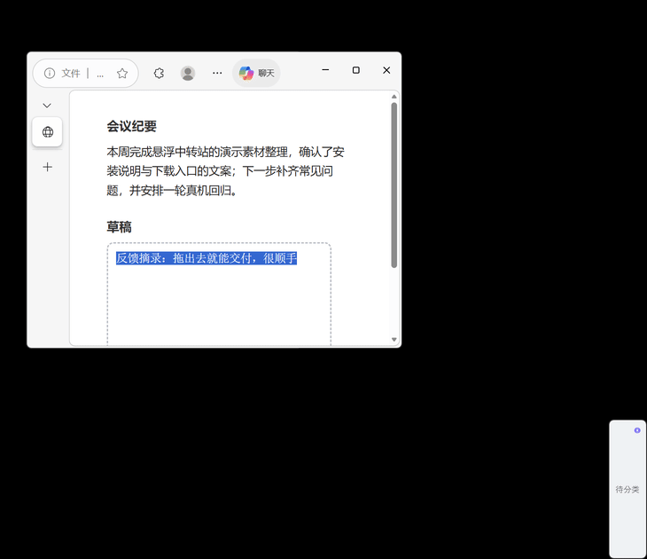
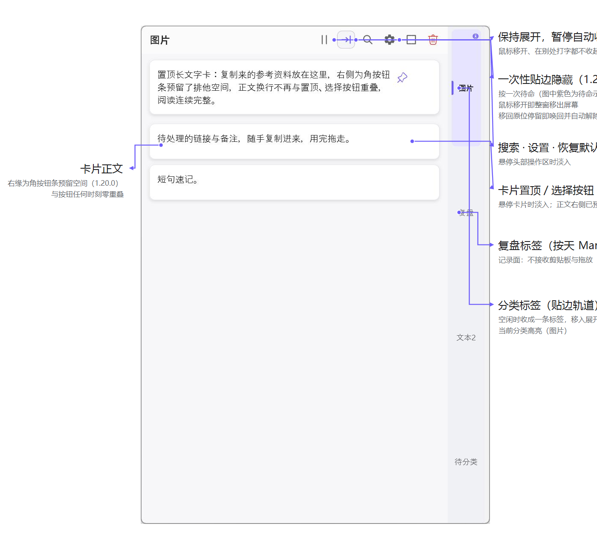
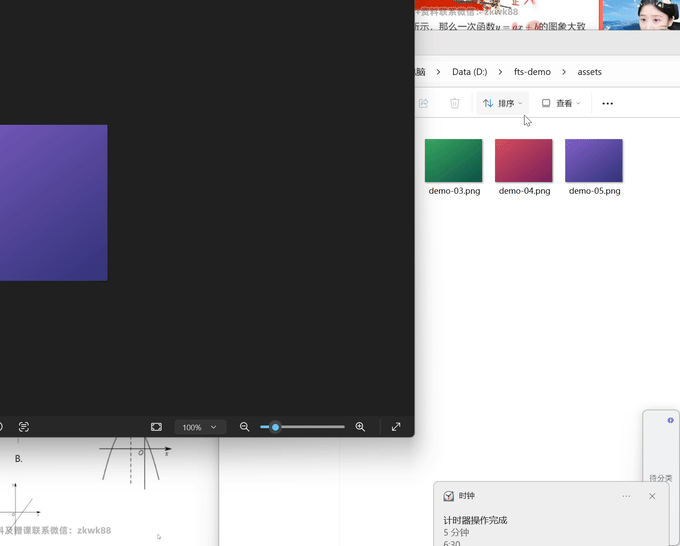
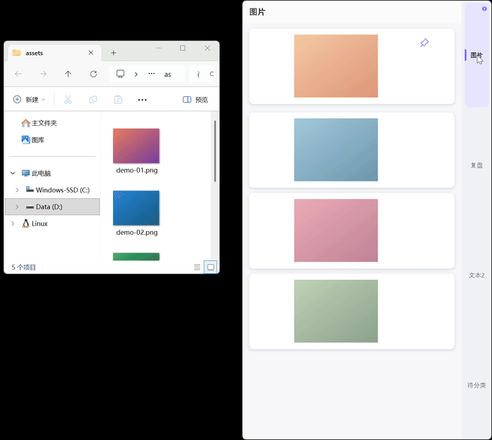
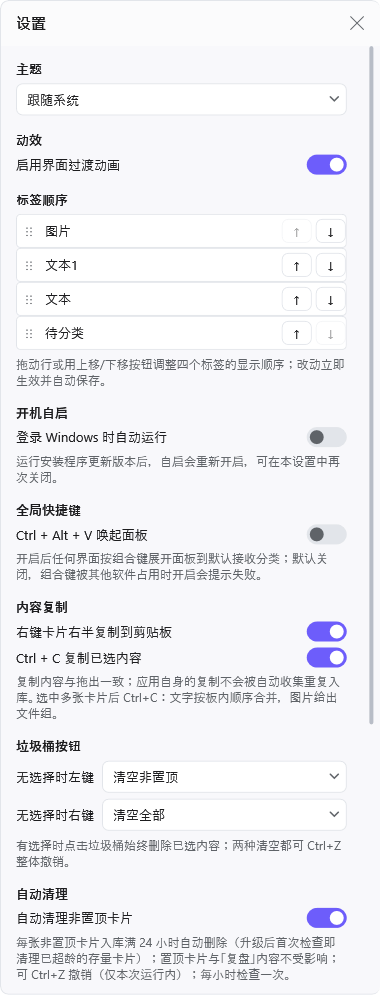
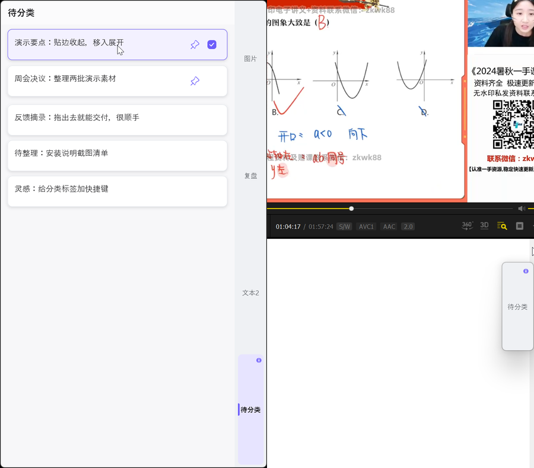
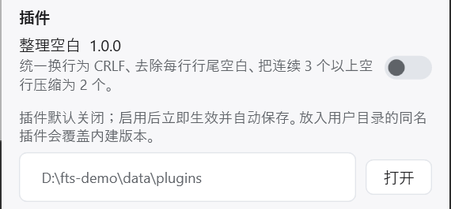
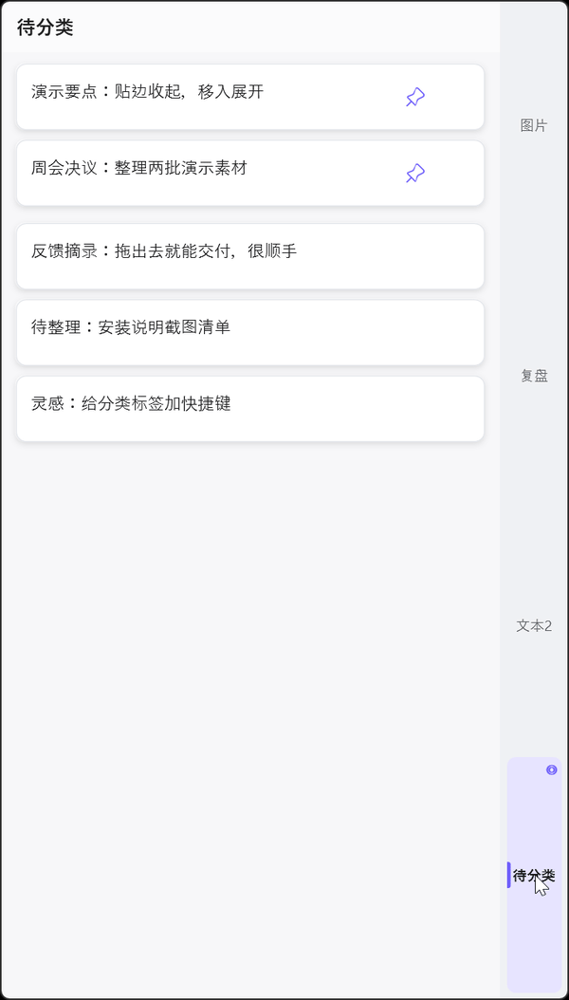

# 悬浮中转站

一个贴在屏幕边缘的文字与图片中转站。复制、拖进来、分个类，再把内容拖到真正需要它的软件里。

<p align="center"></p>

<p align="center"><em>复制的内容自动入库，拖出去即可交付</em></p>

> 支持 Windows 11 64 位。1.7.0 起 Windows 以 Windows 11 为开发与验证目标。2026-10-08 起 Mac 端永久停止开发并已从仓库移除；历史 Release（含 1.6.0 Intel Mac 包与最后的 Apple Silicon 测试包）原样保留在历史发行版中，不撤回、不更新。

## 下载与安装

在 [1.24.0 发行版](https://github.com/Oiawlm/floating-transfer-station/releases/tag/v1.24.0) 下载 Windows 安装程序：

| 平台 | 下载 | 状态 |
|---|---|---|
| Windows 11 x64 | [Windows 安装程序](https://github.com/Oiawlm/floating-transfer-station/releases/download/v1.24.0/FloatingTransferStation-Setup-1.24.0.exe) | 正式版 |

发行页同时提供 `SHA256SUMS.txt`。Windows 无需另装 .NET。

### Windows 安装

1. 运行安装程序。
2. 选择程序安装位置和内容存储父目录；不修改时使用当前用户的本地目录。
3. 安装完成后软件会启动，并在以后登录 Windows 时自动运行。

本地 Windows 构建产物使用中文名，GitHub Release 为了稳定下载链接使用上面的英文文件名。

Release 页面中的 `Source code (zip)` / `Source code (tar.gz)` 是 GitHub 自动生成的源码包。

## 它能做什么

以下为 Windows 正式版说明。



*展开态面板的结构：分类标签、复盘标签、卡片与头部按钮组；一次性贴边隐藏按钮呈紫色待命示意（1.20.0 新增）*

- **随手收集**：复制图片或文字后，内容自动进入当前默认分类；来源标记为禁止历史记录的内容会跳过自动采集。与最近一次成功采集完全相同的单条内容，5 秒内不会重复收集。
- **搜索过滤**：面板头部放大镜或 `Ctrl+F` 搜索当前分类——关键词匹配文字内容，图片/文本 chip 按类型收窄，结果保持置顶在前的顺序；`Esc` 或切换分类退出并还原，过滤不改任何数据。
- **图片容错**：同次复制提供多个图片表示时，读取或解码某个表示失败仍会尝试其他有效表示，优先保存可用图片中像素最多的一份；照片保留正确的旋转或镜像方向。
- **批量复制**：一次复制多张图片保留来源顺序，损坏文件不影响同批其他可用图片。
- **指定位置放入**：可以从资源管理器、浏览器、微信等软件把常见静态图片或非空文字直接拖到某个分类。
- **整理内容**：支持三个可改名板卡分类、一个按天复盘标签、置顶、批量置顶、直接多选、批量移动、批量删除和分类内排序。卡片指针手势按左右对半分区：双击左半就地编辑文字卡，单击右半选中；悬停卡片右上角可对这一张置顶、多选或删除（选中的卡片走顶部批量按钮）。
- **自动清理**：默认开启；开启后每 24 小时自动清理一次各内容分类中非置顶的卡片（无论卡片创建时间），置顶卡片与「复盘」内容不受影响。清理走正常删除路径，可 `Ctrl + Z` 整批撤销（仅本次运行内）；首次清理在开启 24 小时后进行，休眠或重启也不会跳过到期的清理（最长延迟约 1 小时）。可在设置中关闭。
- **再拖出去**：图片和文字使用 Windows 通用拖放格式，可拖到支持这些格式的软件；纯图片多选可以按原顺序一起拖出。
- **复制出去**：右键卡片右半把它复制到剪贴板，再粘贴到游戏聊天窗等无法拖入的目标；面板持有键盘焦点且有选择时 `Ctrl + C` 复制选中项——多条文字按板内顺序合并为一段文本，纯图片多选按原顺序给出文件组，文字+图片混合则两者并存。复制不删除卡片、不进撤销栈，应用自身的复制也不会被自动收集重复入库。
- **不挡工作区**：窗口贴在屏幕右侧并始终保持在所有窗口最上层（其他置顶窗口出现后会自动恢复层级），空闲时收成一条分类标签，移入后再展开。贴边一侧的窗口边缘与屏幕平齐。需要对照面板内容时，点击头部设置按钮左侧的「保持展开」开关（暂停符图标）：面板会一直展开，鼠标移开、点击其他应用或在别处打字都不再自动收起，再次点击恢复自动收起。该开关只对本次运行生效，重启后回到默认的自动收起。想更彻底地让面板消失时，点它旁边的「一次性贴边隐藏」按钮（箭头收入右缘图标，点击后转紫色）：鼠标移开后整个窗口连影子一起移出屏幕，完全不可见、不占任何空间；把鼠标移回它原来的位置停留约 0.2 秒，窗口立即回到原位原形并自动解除，再次使用需再按一次（期间也可用全局唤起快捷键找回；接拔显示器等布局变化会自动恢复窗口，防止找不到）。
- **设置**：点击面板头部的齿轮按钮可打开设置窗口，调整主题（跟随系统/浅色/深色）、界面动效、开机自启、全局快捷键（`Ctrl + Alt + V` 唤起面板，默认关闭）、内容复制手势（右键卡片操作区复制、`Ctrl + C` 复制选中）、垃圾桶按钮无选择时的左右键行为和自动清理（默认开启，每 24 小时清理非置顶卡片），管理文本整理插件，或退出应用；改动立即生效并自动保存。设置内容超过屏幕高度时窗口限高并出现滚动条，可滚动查看全部设置。
- **更改存储位置**：设置中的「数据目录」支持在应用内更换内容存储位置——选择一个父文件夹，应用会在其中创建并管理「悬浮中转站Data」，按安装器同一迁移协议完整复制、校验并原子发布，更新登记后自动重启；旧目录在下次启动并通过安全校验后自动清理。迁移失败时原目录与登记保持原状。「插件目录」也可以改为任意文件夹（默认在数据目录的 `plugins/`），更改保存后重启生效。
- **插件**：把带 `plugin.json` 清单的插件文件夹放进插件目录（默认为数据目录的 `plugins/`，可在设置中改为任意文件夹）即可出现在设置的插件区块；声明式文本整理插件默认关闭，启用后在文字入库前按序应用正则规则（自动采集与外部拖入共用），正则按行匹配（`^`/`$` 锚定每行），规则失败或结果被清空时保留原文；内建"整理空白"示例插件，用户目录中的同名插件会覆盖内建版本。
- **本地保存**：内容、顺序、置顶状态、分类名称和窗口位置保存在本机。

**批量复制**



*一次复制三张图，按来源顺序入库*

**指定位置放入**



*拖到指定分类标签，内容进入该分类*

**整理内容**


*多选、批量置顶、拖到另一分类*

**不挡工作区**


*移开收成标签，移入展开，保持展开不再收起*

**设置**



*设置窗口一屏：主题、动效、自启、快捷键、自动清理、数据目录*

**主题**



*浅色与深色主题同一面板*

**插件**



*声明式插件默认关闭，放入即出现在设置里*

三个板卡分类的默认名称是“图片、文本2、待分类”；“文本1”在升级后变为“复盘”，仍可以修改标签名称。覆盖安装新版本时会保留已保存的分类名称；只有尚未保存名称的分类使用默认值。

复盘标签每天对应一个本地 Markdown 文件，保存在数据目录的 `reviews/yyyy-MM-dd.md`。打开标签即可编辑今天的内容，输入停止后自动保存；用工具栏的 `‹` `›` 按天前后切换（1.16.0 起日期下拉已移除）。文件由 Obsidian 或其他编辑器修改时，应用会刷新；同时编辑会提示保留本地、载入文件或合并。复盘标签不会接收剪贴板或拖放内容。编辑器（含分类改名）持有键盘焦点期间面板不会因指针离开而自动收起——这覆盖中文输入法候选窗出现时系统误报的指针离开；焦点离开后面板按既有节奏收起。



*复盘按天保存，切换日期内容仍在*

## 几个常用操作

- 单击右侧分类标签：切换本次运行的默认接收分类。
- 双击分类标签：原地改名，最多 6 个可见文字单元。
- `F2`：改名当前展开分类；进入编辑后按 `Enter` 保存、按 `Esc` 取消。
- 卡片右半（置顶/选择按钮所在的一半卡面）`Ctrl + 单击` 或卡片选择框：多选内容；右半裸单击与 `Ctrl + 单击` 等效。
- 右半 `Shift + 单击`：从最近一次用选择框或右半单击选中的卡片开始，选择到当前卡片的连续区间；`Ctrl + Shift + 单击` 将区间追加到现有选择。连续调整终点会保持起点；没有有效起点时只选择当前卡片。
- `Ctrl + A`：选择当前分类全部内容；正在编辑分类名称时仍然只会全选文字。
- `Esc`：取消当前分类的全部选择；正在编辑分类名称时仍然取消本次改名。
- `Ctrl + Z`：撤销最近一次删除（单条、批量或清空），恢复到删除前的位置；本次运行内最多保留 20 批，正在编辑文字时不触发。
- 双击卡片左半（文字/图片所在的一半卡面）：文字卡就地编辑内容，`Enter` 保存、`Esc` 取消，切换类目/过滤/滚动使编辑卡离开视图时自动提交；图片卡不可编辑。左半单击（含 `Ctrl`/`Shift`）不改变选择，按住拖动即拖拽。
- 右键卡片右半：把这一张复制到剪贴板（不改变当前选择，搜索过滤态同样可用）；左半右键无操作、不弹菜单。可在设置中关闭。
- `Ctrl + C`：面板持有键盘焦点且有选择时复制选中项——多条文字按板内顺序合并为一段文本，纯图片多选给出文件组，混合选择两者并存；无选择或正在编辑文字时不生效。可在设置中关闭。
- 点击卡片右半图钉：置顶或取消置顶。
- 悬停卡片右上角垃圾桶：只删除这一张，可 `Ctrl + Z` 撤销；不改变当前已选内容和列表位置，按住移出按钮再松开则取消。
- 卡片右上角按钮随状态自动显隐：未选中的卡片悬停时显示置顶/选择/删除三个按钮；已置顶卡片的图钉常显（点击取消置顶）；选中的卡片只保留选择框，置顶和删除走顶部批量按钮——已置顶卡多选时图钉显示为纯置顶状态徽章（点击无效）。
- 多选后点击顶部图钉或按 `Ctrl + P`：批量置顶或取消置顶；只要所选内容中有未置顶项就会统一置顶，全都已置顶时则统一取消置顶；`Ctrl + P` 只在面板展开且不在编辑分类名称时生效。
- 拖动卡片：分类内排序、移动到其他分类，或拖到外部软件。
- 顶部垃圾桶：有选择时左右键都删除选中项；没有选择时左键清空当前分类的非置顶内容（置顶区原样保留），右键清空全部（含置顶）。两种清空都可 `Ctrl + Z` 整体撤销，无选择时的左右键行为可在设置中调整；删除保存期间按钮暂时禁用，避免重复点击误清空。
- 自动清理（设置中可关闭，默认开启）：每 24 小时自动清理一次所有非置顶内容——删除的是当时各内容分类中全部非置顶卡片，无论创建时间；置顶卡片与「复盘」内容保留，可 `Ctrl + Z` 整批撤销；首次清理在开启 24 小时后进行。
- 面板头部暂停符按钮（齿轮左侧）：保持展开——暂停自动收起，方便对照面板内容或在其他界面打字；再次点击恢复自动收起（指针在面板外时约 250ms 后收起）。保持期间从外部拖入内容时面板仍会临时切换为拖放轨道，拖放结束后自动回到展开状态。
- 面板头部齿轮：打开设置窗口（主题/动效/开机自启/全局快捷键/复制手势/垃圾桶行为/插件/数据目录与插件目录更改/关于/退出）。
- `Delete` 或 `Backspace`：只删除选中项；正在编辑文字时仍然正常删字。

## Windows 数据和卸载

默认程序目录是 `%LocalAppData%\Programs\悬浮中转站\`，默认数据目录是 `%LocalAppData%\悬浮中转站\Data\`。安装或更新时可以改选两者的位置。

卸载会删除程序、自启项，以及应用登记并管理的 `悬浮中转站\Data`；不会删除你选择的父目录里的其他文件。重要内容仍建议另外备份。

从 1.4.3 或更早版本升级时，先保留原程序目录完成一次原地更新（1.4.4 或更新版本），再运行安装器更换程序目录；内容存储位置可以照常选择。新卸载器会核对当前安装目录的归属，清理失败会提示并保留数据位置登记。修复前已遗留的旧卸载器无法追溯保护，应从 Windows 设置或当前程序目录进入卸载。

Mac 版已于 2026-10-08 停止开发并从仓库移除；历史 Mac 安装包与说明见 [1.6.0](https://github.com/Oiawlm/floating-transfer-station/releases/tag/v1.6.0) 与 [1.20.0](https://github.com/Oiawlm/floating-transfer-station/releases/tag/v1.20.0) 历史发行版（原样保留，不再更新）。

## 当前限制

以下限制适用于 Windows 正式版。

- 动态分类增删、快捷启动和常驻模式仍在路线图中；设置首版已提供主题、动效与开机自启，剪贴板采集开关等待收集更多使用场景。运行安装程序更新版本后，开机自启会重新开启，可在设置中再次关闭。
- 每个编码图片表示或源文件最多 64 MiB、6,400 万像素；超限不会静默缩小原图。连续大量复制达到待处理容量上限时，会提示稍后重新复制。
- 外部拖放基于 Windows 通用格式；不同软件实际提供的格式不同，因此不是所有来源都能接收。
- B-005 图片分类反馈稍晚、B-006 微信复制图片偶发生成两份目前属于低优先级现场观察（内部记录 B-005/B-006，维护者本地资料，不在仓库），自动测试环境未能稳定复现。

遇到问题可以提交 [Bug 报告](https://github.com/Oiawlm/floating-transfer-station/issues/new?template=bug_report.yml)，有新想法可以提交 [功能建议](https://github.com/Oiawlm/floating-transfer-station/issues/new?template=feature_request.yml)。

## 接下来准备做什么

分类管理、外部拖入激活方式和快捷启动仍需逐项设计。完整说明见 [路线图](ROADMAP.md)。

## 本地开发

```powershell
& .\scripts\bootstrap-dotnet.ps1
& .\.tools\dotnet\dotnet.exe restore FloatingTransferStation.slnx
& .\.tools\dotnet\dotnet.exe test FloatingTransferStation.slnx -c Release --no-restore
```

生成 Windows 安装包：

```powershell
& .\scripts\build-release.ps1
```

默认构建允许 `CHANGELOG.md` 中保留未发布记录；正式发布使用 `build-release.ps1 -ForRelease`，检查步骤见[发布指南](docs/releasing.md)。开发运行不会登记开机自启，自启项由安装器统一管理。版本变化见[更新记录](CHANGELOG.md)。

更完整的改动规则见 [贡献指南](CONTRIBUTING.md)，主要组件与数据流见 [架构说明](docs/architecture.md)。

## 参与贡献

欢迎提交 Bug、使用反馈和 PR。新增主要交互、数据格式、安装/卸载范围或拖放契约前，请先开 Issue 对齐问题和边界，避免大家在不同假设上重复工作。

## 许可证

本项目使用 [MIT License](LICENSE)。
